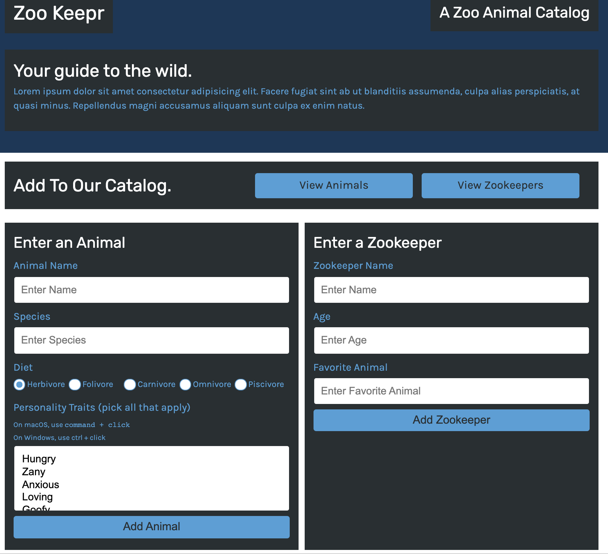

# zookeeper

Backend for zookeeper app. You can post zookeepers and animals. You can also get them and query based on different parameters.



|                                         |                                         |                                                   |
| :-------------------------------------: | :-------------------------------------: | :-----------------------------------------------: |
|       [Introduction](#zookeeper)        | [Table of Contents](#table-of-contents) | [Development Highlights](#development-highlights) |
|      [Installation](#installation)      |             [Tests](#tests)             |       [Code Hightlights](#code-highlights)        |
| [Technologies Used](#Technologies-Used) |           [Credits](#Credits)           |                [License](#License)                |

## Development Highlight

- Use express Router
- Set up GET routes for JSON parameters from req.param and req.query
- Use Insomia Core to test routes.
- Use middleware to properly format incoming data.
- Connected Fetch API to server.

## Installation

Install dependencies.

```
npm i
```

Run the app.

```
node server.js
```

## Test

```
npm test
```

## Code Highlights

Create server using express. Use middleware to format data.

```JavaScript
const express = require('express');

const PORT = process.env.PORT || 3001;
const app = express();
const apiRoutes = require('./routes/apiRoutes');
const htmlRoutes = require('./routes/htmlRoutes');

app.use(express.urlencoded({ extended: true }));
app.use(express.json());
app.use(express.static('public'));

// Use apiRoutes
app.use('/api', apiRoutes);
app.use('/', htmlRoutes);

app.listen(PORT, () => {
  console.log(`API server now on port ${PORT}!`);
});
```

Set up GET routes. If there is a query, the data is filtered in the function to return the proper results.

```JavaScript
router.get('/animals', (req, res) => {
  let results = animals;
  if (req.query) {
    results = filterByQuery(req.query, results);
  }
  res.json(results);
});
```

## Technologies Used

### Backend Languages

- [Node.js](https://nodejs.org/en/)

### Backend Framework

- [Express.js](https://expressjs.com/)

### Testing

- [jest](https://jestjs.io/);

## Credits

|                           |                                                                                                                                                                                                       |
| ------------------------- | ----------------------------------------------------------------------------------------------------------------------------------------------------------------------------------------------------- |
| **David Anusontarangkul** | [ LinkedIn](https://www.linkedin.com/in/anusontarangkul/) [ GitHub](https://github.com/anusontarangkul) |

## License

[](https://opensource.org/licenses/MIT)
